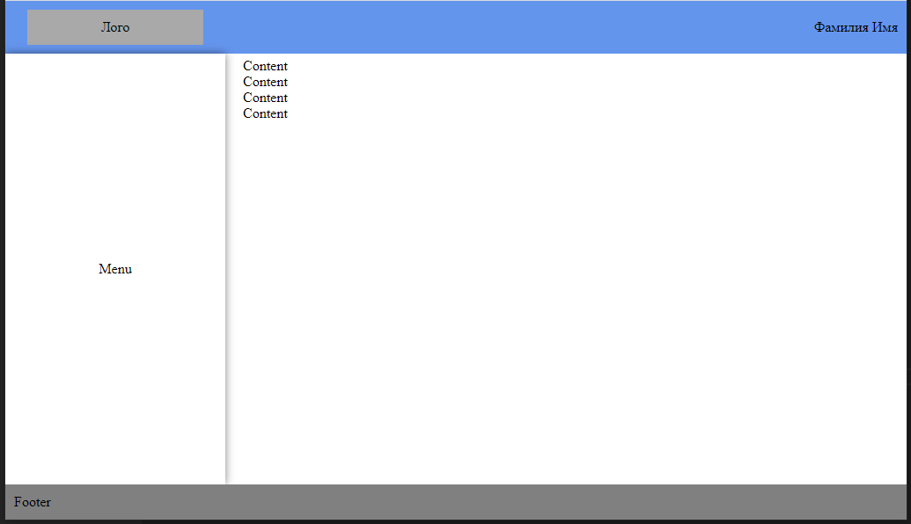
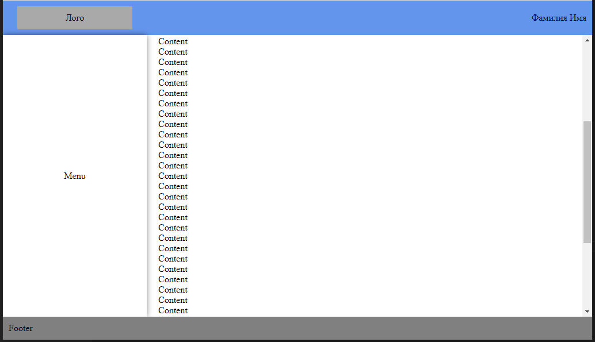

    

 
 

  <strong>Тестовое задание для Верстальщика (Junior) от компании UDV</strong>
   
  <strong>(УЦСБ.Разработка)</strong>

 

Реализация предложенного дизайна

1. Header
   - фиксированная высота 60px
   - лого прижато к левому краю
   - есть информация о пользователе (ФИО) - прижата к правому краю
   - header не скроллится
2. Footer
   - фиксированная высота 40px;
   - footer не скроллится
3. Боковое меню
   - фиксированная ширина 250px
   - занимает всю высоту страницы между header и footer
   - боковое меню не скроллится
4. Контент
   - занимает всю высоту страницы между header и footer
   - скроллится

Черновик:

  
  

 

  <strong>Удачи!</strong>

